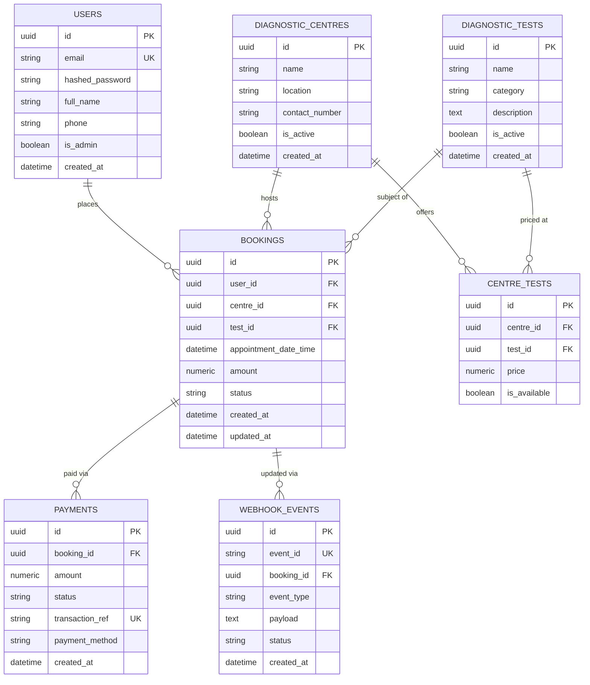
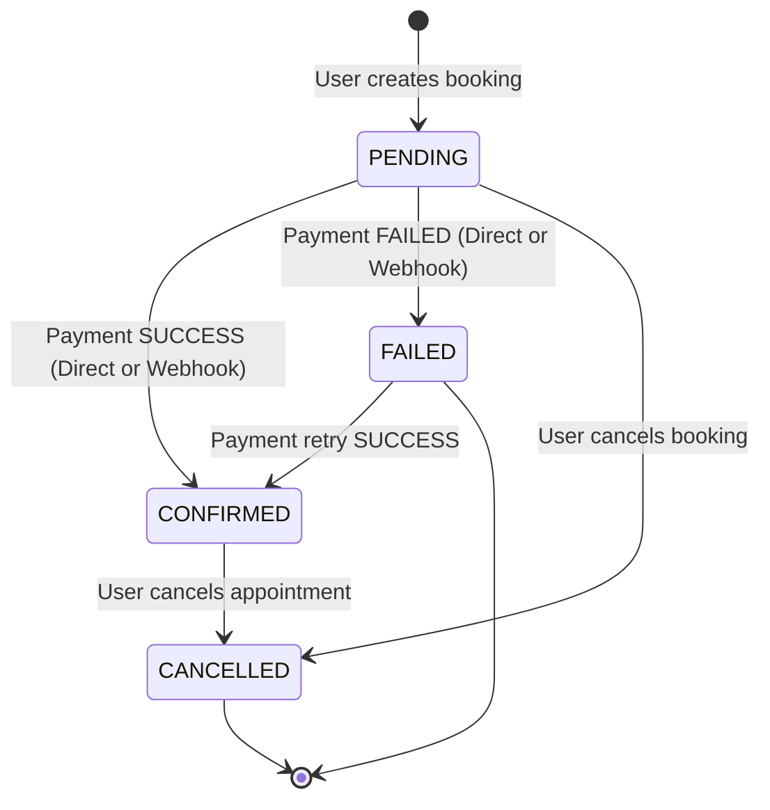

# 🏥 EVE Healthcare — Diagnostic Test Booking & Simulated Payment Backend Service

[](https://www.python.org/downloads/)
[](https://fastapi.tiangolo.com/)
[-red.svg)](https://www.sqlalchemy.org/)
[](https://www.postgresql.org/)
[](https://www.docker.com/)
[-brightgreen.svg)]()

A robust, production-grade backend service built for diagnostic test bookings, pricing management across centres, simulated payment processing, and **strictly idempotent webhook handling**.

---

## 📑 Table of Contents

- [Architectural Overview](#-architectural-overview)
- [Key Features](#-key-features)
- [Database Schema & Design](#-database-schema--design)
- [Booking State Machine](#-booking-state-machine)
- [Idempotent Webhook Engine](#-idempotent-webhook-engine)
- [Quick Start: Running Locally](#-quick-start-running-locally)
  - [Option A: Local Virtualenv (Zero-Config SQLite)](#option-a-local-virtualenv-zero-config-sqlite)
  - [Option B: Docker Compose (PostgreSQL)](#option-b-docker-compose-postgresql)
- [Database Seeding](#-database-seeding)
- [Running Automated Tests](#-running-automated-tests)
- [API Reference & Example Requests (cURL)](#-api-reference--example-requests-curl)
  - [1. Authentication](#1-authentication)
  - [2. Diagnostic Centres & Tests](#2-diagnostic-centres--tests)
  - [3. Diagnostic Test Bookings](#3-diagnostic-test-bookings)
  - [4. Simulated Payment Service](#4-simulated-payment-service)
  - [5. Payment Webhook (Idempotent)](#5-payment-webhook-idempotent)
- [Edge Cases Handled](#-edge-cases-handled)
- [Important Assumptions](#-important-assumptions)
- [What Would Be Improved With More Time](#-what-would-be-improved-with-more-time)

---

## 🏗 Architectural Overview

The application follows a clean, layered architecture separating routing, business logic, persistence, and serialization:

```
├── app/
│   ├── main.py              # FastAPI app instance, CORS, exception handlers, lifespan
│   ├── database.py          # Async engine, sessionmaker, table auto-initialization
│   ├── core/
│   │   ├── config.py        # Typed application settings via Pydantic BaseSettings
│   │   ├── security.py      # Native bcrypt hashing & PyJWT token creation/verification
│   │   └── logging.py       # Centralized structured logger
│   ├── models/              # SQLAlchemy 2.0 async ORM models (DeclarativeBase)
│   │   ├── user.py, centre.py, test.py, booking.py, payment.py, webhook_event.py
│   ├── schemas/             # Pydantic v2 validation DTOs and serializers
│   │   ├── auth.py, centre.py, test.py, booking.py, payment.py, common.py
│   ├── services/            # Pure domain services encapsulating business logic
│   │   ├── auth_service.py, centre_service.py, booking_service.py
│   │   ├── payment_service.py, webhook_service.py
│   └── api/
│       ├── deps.py          # FastAPI dependency injection (get_db, current_user, admin)
│       └── v1/              # Versioned API routes (/auth, /centres, /tests, /bookings, /payments)
├── scripts/
│   └── seed_data.py         # Automated database seeder with centres, tests, and demo users
├── tests/                   # Pytest suite with isolated in-memory DB and async client
├── Dockerfile               # Multi-stage production container image
├── docker-compose.yml       # Production stack with PostgreSQL
└── requirements.txt         # Pinned production and test dependencies
```

---

## ✨ Key Features

1. **JWT-Based Authentication**: Secure password hashing with `bcrypt` (Python 3.13 standard compatible) and signed Bearer JWT access tokens. Role-based access control (`is_admin` vs patient).
2. **Flexible Centre & Test Pricing**: Diagnostic tests are modeled independently from diagnostic centres via a `CentreTest` junction model. A single test (e.g. *Blood Test*) can be configured with centre-specific pricing and availability.
3. **Price Locking at Booking**: When a booking is created, the current price is captured as a financial snapshot (`amount`), ensuring future price updates never alter historical bookings.
4. **Simulated Payment Gateway**: Direct mock payment endpoint (`POST /payments/`) returning `SUCCESS` or `FAILED` and atomically updating booking status.
5. **Strict Webhook Idempotency**: `POST /payments/webhook/` prevents duplicate processing, race conditions, and corrupted booking states using dedicated `WebhookEvent` unique tracking.
6. **Authorization Isolation**: Patients can only inspect, pay for, and cancel their own bookings (`403 Forbidden` for other users).
7. **Interactive OpenAPI / Swagger**: Complete API documentation with interactive try-it-out controls at `/docs` and `/redoc`.

---

## 🗄 Database Schema & Design



---

## 🔄 Booking State Machine



* **Guard Rails**:
  * An already `CONFIRMED` booking cannot be re-paid or overwritten by duplicate payments.
  * An already `CANCELLED` booking cannot be revived by late-arriving payment webhooks.
  * A `FAILED` booking cannot be cancelled (it has already terminated).

---

## 🛡 Idempotent Webhook Engine

Payment gateways (Stripe, Razorpay, Adyen, etc.) employ *at-least-once delivery*, meaning network timeouts or retries frequently result in duplicate webhook deliveries.

Our webhook handler implements strict idempotency:
1. **Deduplication Check**: Before executing state transitions, the database is queried for `event_id`.
2. **Unique Database Constraint**: `WebhookEvent.event_id` is guarded by a database unique constraint index.
3. **Atomic Commit & Concurrency Recovery**: If two duplicate webhooks arrive simultaneously at the same millisecond, the first commits and the second catches the `IntegrityError`, performing a safe rollback and returning an idempotent `200 OK` with `{"status": "DUPLICATE_IGNORED"}` without corrupting booking state or creating duplicate payment transactions.
4. **State Protection**: If a webhook arrives for a booking that was already cancelled by the patient, the event is recorded as `IGNORED_CANCELLED` and does not reactivate the booking.

---

## 🚀 Quick Start: Running Locally

### Option A: Local Virtualenv (Zero-Config SQLite)

The application includes zero-dependency SQLite async support (`aiosqlite`) enabled by default.

```bash
# 1. Clone repository & enter directory
cd "EVE - Healthcare assignment"

# 2. Create and activate virtual environment
python3 -m venv .venv
source .venv/bin/activate

# 3. Install dependencies
pip install -r requirements.txt

# 4. (Optional) Seed demo data (Admin, Patient, Centres, Tests)
python scripts/seed_data.py

# 5. Start the FastAPI development server
uvicorn app.main:app --reload --port 8000
```

Once running:
- **Interactive Swagger Docs**: [http://localhost:8000/docs](http://localhost:8000/docs)
- **ReDoc Documentation**: [http://localhost:8000/redoc](http://localhost:8000/redoc)
- **Health Check**: [http://localhost:8000/health](http://localhost:8000/health)

---

### Option B: Docker Compose (PostgreSQL)

To run the complete production-grade stack with PostgreSQL:

```bash
docker-compose up --build
```

The API will be available at `http://localhost:8000` with PostgreSQL persisting in Docker volume `postgres_data`.

---

## 🧪 Database Seeding

Run the seed script at any time to populate demo records:

```bash
python scripts/seed_data.py
```

**Pre-seeded Credentials:**
* **Administrator**:
  * Email: `admin@evehealthcare.com`
  * Password: `AdminPass123!`
* **Patient**:
  * Email: `patient@evehealthcare.com`
  * Password: `PatientPass123!`

---

## 🧪 Running Automated Tests

A comprehensive test suite of 26 integration tests covers authentication, centre/test management, booking validation, authorization isolation, payment simulations, and webhook idempotency:

```bash
# Run pytest with verbose reporting
pytest -v
```

Output:
```
tests/test_auth.py::test_user_signup_success PASSED
tests/test_auth.py::test_user_signup_duplicate_email PASSED
tests/test_auth.py::test_user_signup_validation_error PASSED
tests/test_auth.py::test_user_login_success PASSED
tests/test_auth.py::test_user_login_wrong_password PASSED
tests/test_auth.py::test_get_current_user_profile PASSED
tests/test_auth.py::test_get_profile_unauthorized PASSED
tests/test_centres_tests.py::test_admin_create_centre PASSED
tests/test_centres_tests.py::test_patient_cannot_create_centre PASSED
tests/test_centres_tests.py::test_admin_create_test PASSED
tests/test_centres_tests.py::test_assign_test_to_centre PASSED
tests/test_centres_tests.py::test_get_centre_with_available_tests PASSED
tests/test_centres_tests.py::test_list_centres_filter PASSED
tests/test_centres_tests.py::test_assign_test_invalid_centre PASSED
tests/test_bookings.py::test_create_booking_success PASSED
tests/test_bookings.py::test_create_booking_past_date_fails PASSED
tests/test_bookings.py::test_create_booking_unoffered_test PASSED
tests/test_bookings.py::test_booking_authorization_isolation PASSED
tests/test_bookings.py::test_cancel_booking PASSED
tests/test_payments.py::test_simulated_payment_success PASSED
tests/test_payments.py::test_simulated_payment_failed PASSED
tests/test_payments.py::test_cannot_pay_already_confirmed_booking PASSED
tests/test_payments.py::test_unauthorized_payment_rejected PASSED
tests/test_webhook_idempotency.py::test_webhook_payment_success PASSED
tests/test_webhook_idempotency.py::test_webhook_strict_idempotency PASSED
tests/test_webhook_idempotency.py::test_webhook_does_not_corrupt_cancelled_booking PASSED

======================== 26 passed in 11.07s ========================
```

---

## 📡 API Reference & Example Requests (cURL)

*Note: All endpoints are accessible both under `/api/v1/` and directly at root `/payments/` as specified in the assignment prompt.*

### 1. Authentication

#### User Signup
```bash
curl -X POST "http://localhost:8000/api/v1/auth/signup" \
  -H "Content-Type: application/json" \
  -d '{
    "email": "user@example.com",
    "password": "Password123!",
    "full_name": "Sarah Connor",
    "phone": "+1-555-0199"
  }'
```

#### User Login (Returns JWT Access Token)
```bash
curl -X POST "http://localhost:8000/api/v1/auth/login" \
  -H "Content-Type: application/json" \
  -d '{
    "email": "user@example.com",
    "password": "Password123!"
  }'
```
Response:
```json
{
  "access_token": "eyJhbGciOi...",
  "token_type": "bearer"
}
```

#### Get Current User Profile
```bash
curl -X GET "http://localhost:8000/api/v1/auth/me" \
  -H "Authorization: Bearer <TOKEN>"
```

---

### 2. Diagnostic Centres & Tests

#### List Diagnostic Centres (with Search & Pagination)
```bash
curl -X GET "http://localhost:8000/api/v1/centres/?location=New%20York&limit=10&offset=0"
```

#### Get Centre Details with Available Tests & Prices
```bash
curl -X GET "http://localhost:8000/api/v1/centres/<CENTRE_ID>"
```
Response:
```json
{
  "id": "7329596c-b633-4efc-8d19-ef865261eb2e",
  "name": "Apollo Diagnostics Central",
  "location": "120 Park Ave, New York, NY",
  "contact_number": "+1-212-555-0111",
  "is_active": true,
  "created_at": "2026-10-02T16:05:00Z",
  "tests": [
    {
      "test_id": "893b1675-9b26-4cb0-a664-ba8d1458be5b",
      "test_name": "Complete Blood Count (CBC)",
      "category": "Hematology",
      "price": 45.0,
      "is_available": true
    }
  ]
}
```

#### Create a Diagnostic Test (Admin Only)
```bash
curl -X POST "http://localhost:8000/api/v1/tests/" \
  -H "Authorization: Bearer <ADMIN_TOKEN>" \
  -H "Content-Type: application/json" \
  -d '{
    "name": "MRI Brain with Contrast",
    "category": "Radiology",
    "description": "Magnetic resonance imaging of brain tissue"
  }'
```

#### Assign Test to Centre with Custom Price (Admin Only)
```bash
curl -X POST "http://localhost:8000/api/v1/centres/<CENTRE_ID>/tests" \
  -H "Authorization: Bearer <ADMIN_TOKEN>" \
  -H "Content-Type: application/json" \
  -d '{
    "test_id": "<TEST_ID>",
    "price": 140.00,
    "is_available": true
  }'
```

---

### 3. Diagnostic Test Bookings

#### Create a Booking (Authenticated Patient)
```bash
curl -X POST "http://localhost:8000/api/v1/bookings/" \
  -H "Authorization: Bearer <PATIENT_TOKEN>" \
  -H "Content-Type: application/json" \
  -d '{
    "centre_id": "<CENTRE_ID>",
    "test_id": "<TEST_ID>",
    "appointment_date_time": "2026-10-15T10:30:00Z"
  }'
```
Response:
```json
{
  "id": "3c0235b0-333e-4ca8-9f3d-a5170d4fcb14",
  "user_id": "a98818f2-8b63-44eb-b630-f2038b3400a9",
  "centre_id": "7329596c-b633-4efc-8d19-ef865261eb2e",
  "test_id": "893b1675-9b26-4cb0-a664-ba8d1458be5b",
  "appointment_date_time": "2026-10-15T10:30:00Z",
  "amount": 45.0,
  "status": "PENDING",
  "centre_name": "Apollo Diagnostics Central",
  "test_name": "Complete Blood Count (CBC)",
  "created_at": "2026-10-02T16:05:00Z",
  "updated_at": "2026-10-02T16:05:00Z"
}
```

#### List Bookings for Current User
```bash
curl -X GET "http://localhost:8000/api/v1/bookings/?status=PENDING" \
  -H "Authorization: Bearer <PATIENT_TOKEN>"
```

#### Cancel a Booking
```bash
curl -X POST "http://localhost:8000/api/v1/bookings/<BOOKING_ID>/cancel" \
  -H "Authorization: Bearer <PATIENT_TOKEN>"
```

---

### 4. Simulated Payment Service

#### Direct Payment Simulation (`POST /payments/`)
Simulates payment processing. Can set `simulate_status` to `"SUCCESS"` or `"FAILED"`.

```bash
curl -X POST "http://localhost:8000/payments/" \
  -H "Authorization: Bearer <PATIENT_TOKEN>" \
  -H "Content-Type: application/json" \
  -d '{
    "booking_id": "<BOOKING_ID>",
    "payment_method": "CREDIT_CARD",
    "simulate_status": "SUCCESS"
  }'
```
Response:
```json
{
  "id": "a1b2c3d4-e5f6-7890-abcd-ef1234567890",
  "booking_id": "3c0235b0-333e-4ca8-9f3d-a5170d4fcb14",
  "amount": 45.0,
  "status": "SUCCESS",
  "transaction_ref": "txn_mock_3f8a9e01cd12",
  "payment_method": "CREDIT_CARD",
  "booking_status": "CONFIRMED",
  "created_at": "2026-10-02T16:10:00Z"
}
```

---

### 5. Payment Webhook (Idempotent)

#### Webhook Endpoint (`POST /payments/webhook/`)
Simulates asynchronous gateway callbacks.

```bash
curl -X POST "http://localhost:8000/payments/webhook/" \
  -H "Content-Type: application/json" \
  -d '{
    "event_id": "evt_gateway_pay_987123",
    "booking_id": "<BOOKING_ID>",
    "status": "SUCCESS",
    "amount": 45.0
  }'
```
Response on initial delivery:
```json
{
  "status": "PROCESSED",
  "message": "Webhook event processed successfully. Booking is now CONFIRMED.",
  "event_id": "evt_gateway_pay_987123",
  "booking_id": "3c0235b0-333e-4ca8-9f3d-a5170d4fcb14",
  "booking_status": "CONFIRMED"
}
```

Response on **duplicate redelivery** (same `event_id`):
```json
{
  "status": "DUPLICATE_IGNORED",
  "message": "Duplicate webhook event received; safely ignored to ensure idempotency.",
  "event_id": "evt_gateway_pay_987123",
  "booking_id": "3c0235b0-333e-4ca8-9f3d-a5170d4fcb14",
  "booking_status": "CONFIRMED"
}
```

---

## 🛡 Edge Cases Handled

| Scenario | System Behavior | HTTP Status |
| :--- | :--- | :---: |
| **Duplicate Webhook Delivery** | Safely detected via `event_id` lookup; returns idempotent success without duplicate DB mutations | `200 OK` |
| **Concurrent Duplicate Webhook Race** | Unique constraint catches `IntegrityError`, rolls back transaction, returns idempotent response | `200 OK` |
| **Webhook for Cancelled Booking** | Safely logged as `IGNORED_CANCELLED`; does not reactivate or overwrite cancelled booking | `200 OK` |
| **Payment for Non-Existent Booking** | Explicit error response indicating booking was not found | `404 Not Found` |
| **Payment for Already Confirmed Booking** | Rejects payment attempt to prevent double charging | `400 Bad Request` |
| **Cross-User Resource Modification** | User attempting to view, pay for, or cancel another user's booking | `403 Forbidden` |
| **Appointment in the Past** | Validated via Pydantic validator before database write | `422 Unprocessable` |
| **Booking an Unavailable Test** | Checks whether the centre has an active mapping for that test | `400 Bad Request` |
| **Duplicate Email Registration** | Handled before password hashing | `409 Conflict` |

---

## 📌 Important Assumptions

1. **Independent Test & Centre Pricing**: Different diagnostic centres may charge different prices for the exact same test. Hence, price belongs to the `CentreTest` junction table rather than directly on `DiagnosticTest`.
2. **Price Snapshot Immutability**: When a patient creates a booking, `amount` is copied from the active `CentreTest.price`. Even if the diagnostic centre alters test prices later, existing bookings remain unchanged.
3. **Webhook Protocol**: Responding with `200 OK` on duplicate webhook deliveries follows standard payment gateway protocols (Stripe, Razorpay, Adyen), signalling to the gateway that the event was received and retries should stop.
4. **JWT Lifespan**: Access tokens default to 24 hours for seamless developer testing and can be customized via `ACCESS_TOKEN_EXPIRE_MINUTES`.
5. **Database Agnosticism**: Uses SQLAlchemy 2.0 async abstractions with type guards supporting both SQLite (`sqlite+aiosqlite`) for zero-install dev/testing and PostgreSQL (`postgresql+asyncpg`) for containerized deployment.

---

## 🚀 What Would Be Improved With More Time

1. **Redis Caching**: Cache `GET /centres/` and `GET /tests/` with automatic cache eviction on test/centre modifications.
2. **Webhook HMAC Signature Verification**: Add cryptographic signature verification (`X-Signature: sha256=...`) with timestamp replay defense.
3. **Background Job Queue (Celery / ARQ)**: Asynchronously dispatch booking confirmation emails, SMS notifications, and calendar invites.
4. **Slot Capacity Management**: Real-time slot locking (e.g., max 5 patients per 30-minute interval per centre) using Redis distributed locks.
5. **Refunds & Webhook Reversals**: Add refund workflow for cancelled bookings that had already been paid.
6. **Alembic Database Migrations**: Formal migration version tracking for automated zero-downtime schema upgrades.
